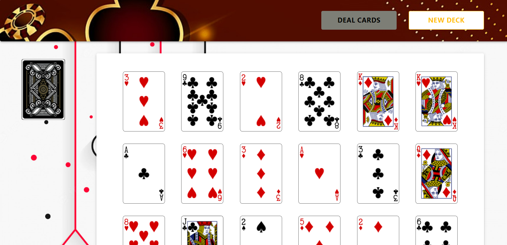

# Deck_Of_Card

Program design for draws cards from a deck. It keeps drawing cards from the deck until it has drawn a QUEEN of every suit.

<p align="center">
  
</p>

This project was bootstrapped with [Create React App](https://github.com/facebook/create-react-app).

## Intruction to Run de Proyect
First clone the repo to your desktop.

Then run the next command to install dependencies 

```bash
npm install
yarn install
```
Next, in the project directory, you can execute:

```bash
npm start
```

Runs the app in the development mode.\
Open [http://localhost:3000](http://localhost:3000) to view it in the browser.

The page will reload if you make edits.\
You will also see any lint errors in the console.

## Learn More

You can learn more in the [Create React App documentation](https://facebook.github.io/create-react-app/docs/getting-started).

To learn React, check out the [React documentation](https://reactjs.org/).
